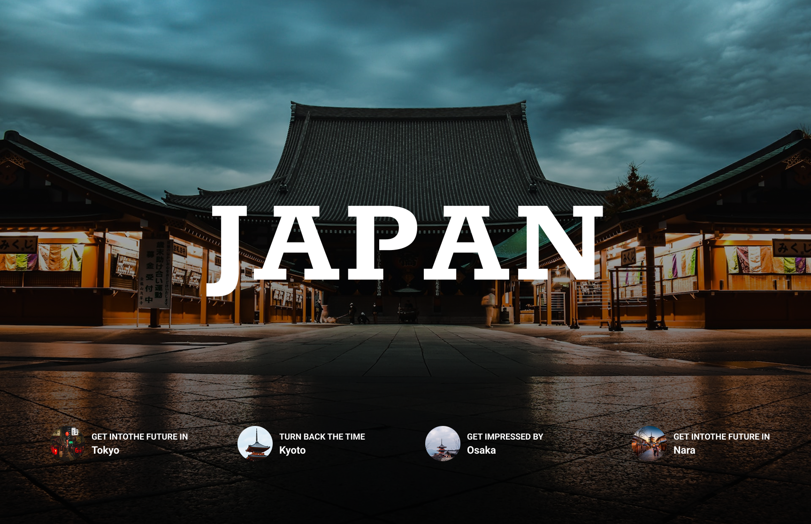

# NIHON | 日本 - Elite Digital Experience

[](YOUR_VERCEL_URL)
[](https://github.com/KMV531/nihon.git)

⚡ **A premium, high-fidelity web experience** blending Japanese minimalism with aggressive device-specific storytelling. Built for users who value design integrity over convenience.



## ✨ Signature Features

- **Device-Aware Gatekeeping**: Custom Edge Middleware that intercepts mobile traffic to protect the site's desktop-first visual integrity.
- **Magnetic Interactions**: Custom-built `Magnet` components for high-end UI engagement and tactile feedback.
- **Narrative Loading States**: A "Device Ego Compression" sequence to bridge the gap between restricted and permitted access.
- **Torii Navigation**: A thematic "Ascend to Summit" scroll-to-top feature with responsive visibility logic and Torii Gate iconography. ⛩️
- **Easter Egg Protocol**: Implements the legendary **HTTP 403 (DEVELOPER'S EGO TOO BIG)** status for unauthorized device access attempts.

## 🛠️ Technology Stack

| Component       | Technology              | Narrative Purpose                   |
| --------------- | ----------------------- | ----------------------------------- |
| **Framework**   | Next.js 16 (App Router) | Server-side logic & optimized SSR   |
| **Styling**     | Tailwind CSS            | Minimalist, high-contrast aesthetic |
| **Logic Layer** | Edge Middleware         | Real-time device interrogation      |
| **Animations**  | Framer Motion, GSAP     | Fluid, magnetic micro-interactions  |
| **Type Safety** | TypeScript              | Robust, scalable architecture       |

## 🚀 The "Troll" Architecture

This project utilizes a **Server-Side Security Gate** rather than simple CSS media queries to enforce a specific user journey.

1. **Detection**: Middleware scans the `User-Agent` before the page renders to determine device type.
2. **Redirection**: Unauthorized devices (mobile/tablets) are routed to a custom "Abort" sequence.
3. **Bypass**: Access is only granted via a "Secret Pass" cookie, ensuring the user acknowledges the "Sensei's" warnings.
4. **Validation**: Built-in `Suspense` boundaries handle dynamic client-side state for production-ready deployment.

## 🌟 Why This Stands Out

**This isn't just a landing page; it's a Brand Statement:**

- **Zero Layout Shift**: Strategic use of pre-rendering and suspense ensures a "Flicker-Free" experience even during conditional rendering.
- **Micro-copy Branding**: Every error message, status code, and footer line is curated to reinforce the "NIHON" persona.
- **Interactive Precision**: Uses magnetic physics to pull user focus toward key call-to-action elements.

## 🤝 Collaboration & Inquiries

**Specializing in high-concept, narrative-driven web applications:**

📞 **Contact**: koladjamomo@gmail.com <br />

**Deployed with ❤️ on Vercel**

## 💻 Development Setup

1. **Clone the repository:**

   ```bash
   git clone https://github.com/KMV531/nihon.git

   ```

2. Install dependencies:

   ```bash
   npm install

   ```

3. Run development server:
   ```bash
   npm run dev
   ```
